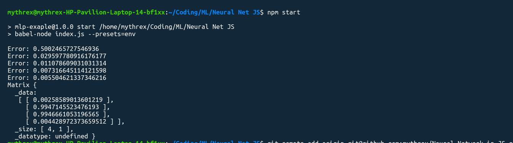

# Neural-Network-in-JS

I found this amazing blog where this guy taught how to implement a simple neural network in JS

Source: [https://dev.to/liashchynskyi/creating-of-neural-network-using-javascript-in-7minutes-o21](https://dev.to/liashchynskyi/creating-of-neural-network-using-javascript-in-7minutes-o21)

